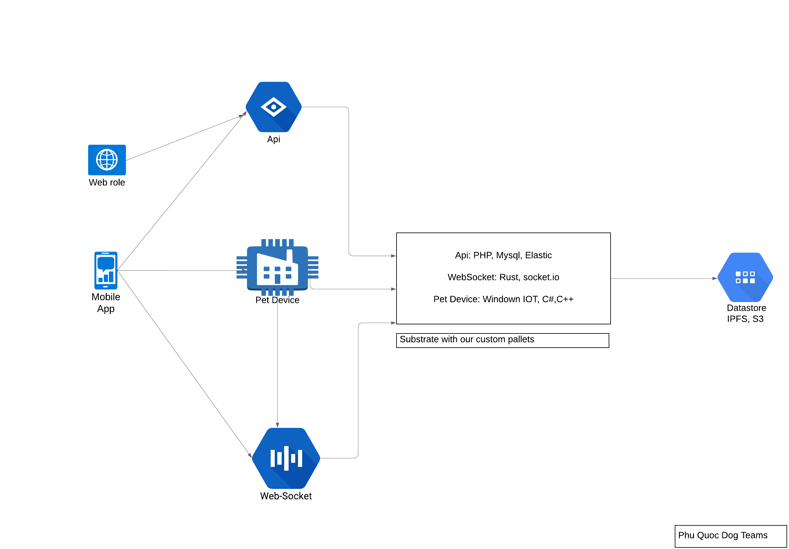

# Welcome to Phu Quoc Dog

This site provides documentation for Phu Quoc Dog, an Operating System parachain on the Polkadot network. Here, you'll find both high-level and technical information for developers, collators, end users, and other Phu Quoc Dog network participants.

This site will be updated from as Phu Quoc Dog evolves. We welcome everyone joins the Phu Quoc Dog community and contribute to this site and the project.

## What is Phu Quoc Dog

Decentralized dogs social network, it is the best social network for pets, where you can share photos and videos of your pet's life, rescue puppies, adopt a pet, find pet friendly places and take advantage of our useful pet services. Join the moon mission. 🐶

Phu Quoc Dog is a Substrate-based Polkadot parachain. Phu Quoc Dog is committed to providing easy-to-use blockchain infrastructure and creating a one-stop comprehensive infrastructure platform, which aims to reduce the threshold and cost for developers, while bringing them great returns.

PQD is a real token used to run ads on pet social networking platforms as well as exchanges related to shopping for pet products and services.

With the mission to bring connection, develop love between people and pets. PQD helps the conservation of precious dog species such as Phu Quoc dog. At the same time, taking measures to limit the killing and eating of dogs and cats. Further, contributing to the protection of wildlife species.

PQD brings real values to life; not only for pet lovers but also for investors who know how to seize the opportunity.

PQD is constantly learning and improving its technical system and has strategic orientation as well as appropriate tactics to meet those positive needs.

PQD is the native token of the Polkadot network in a similar way that BTC is the native token of Bitcoin or Ether is the native token of the Ethereum blockchain.

The smallest unit of account in a Substrate network \(Polkadot, Kusama, etc.\) is the Planck \(a reference to [Planck Length](https://en.wikipedia.org/wiki/Planck_length), the smallest possible distance in the physical Universe\). You can compare the Planck to Satoshis or Wei, while the PQD is like a bitcoin or an ether. Kusama tokens \(KSM\) are equal to 1e12 Planck, and Polkadot mainnet PQD is equal to 1e10 Planck.

| Unit | Decimal Places | Example |
| :--- | :--- | :--- |
| Planck | 0 | 0.0000000001 |
| Microdot \(uPQD\) | 4 | 0.0000010000 |
| Millidot \(mPQD\) | 7 | 0.0010000000 |
| PQD \(PQD\) | 10 | 1.0000000000 |

You can checkout current total issuance Phu Quoc Dog Coin at [https://portal.phuquocdog.com/\#/explorer](https://portal.phuquocdog.com/#/explorer)

### Architecture

Substrate and IPFS/S3 are the only required parts of the Phu Quoc Dog protocol.

Our project includes:

* Back-end developed in PHP, running on MySQL, Elastic and using Web3J.
* UI and Mobile app developed in React.js and React native.
* Blockhain part : Binance Smart Chain \(public and private\), Polkadot Technology, either ready-to-use framework or Parathread \(and Relay Chain\)

### Blockchain Operating System

Phu Quoc Dog is a Blockchain Operating System, which contains storage layer, smart contract layer, Defi protocol layer and eApp layer, in details:

* Storage layer: Storage protocol layer supports distributed storage of dApp data. The supported protocols are IPFS, AR, CRUST etc.
* Smart contract layer: It supports one-stop cross-chain deployment and calls of dApp. Phu Quoc Dog provides a Web3-compatible API,  and existing web3 dApps can be migrated to Phu Quoc Dog without any change needed.
* Defi protocol layer: It supports various basic Defi protocols, such as Swap, Lending, Insurance, etc. It also provides a platform on where developers can build their own Defi protocols. Also, Phu Quoc Dog provides a drag-drop smart contract compiler, which is easy-to-use, faultless and can be compiled to WASM.
* eApp layer: It supports the evolution from dApp to eApp \(External App\). Developers can build and deploy their eApp easily on Phu Quoc Dog, without the need for machines, domain names, or network bandwidth.

### Built on Substrate

Substrate is technically fit for Phu Quoc Dog. By building on top of Substrate, Phu Quoc Dog is able to leverage the extensive functionalities that Substrate provides out-of-the-box, rather than needing to build them from scratch. These functionalities include peer-to-peer networking, consensus mechanisms, governance functionality, EVM implementation, and more.

Overall, using Substrate will dramatically reduce the time and work needed to implement Phu Quoc Dog. Substrate allows a great degree of customization, which is compulsory when achieving compatibility with Ethereum. Meanwhile, by adopting Rust, Phu Quoc Dog will gain both safety guarantee and performance enhancement.

### How to Engage With the Phu Quoc Dog Community


Phu Quoc Dog TestNet and community will be available soon...


