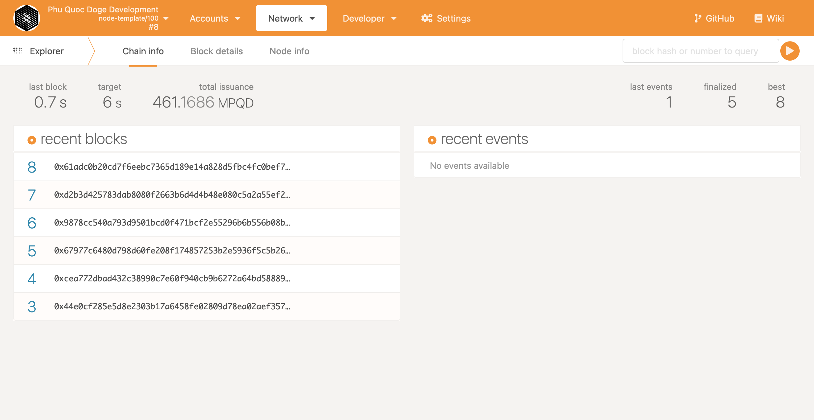
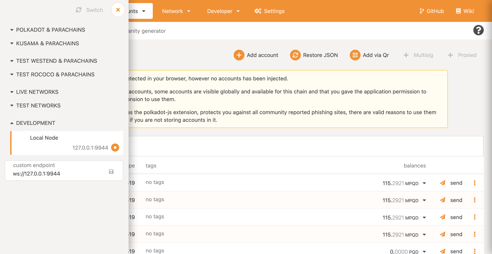
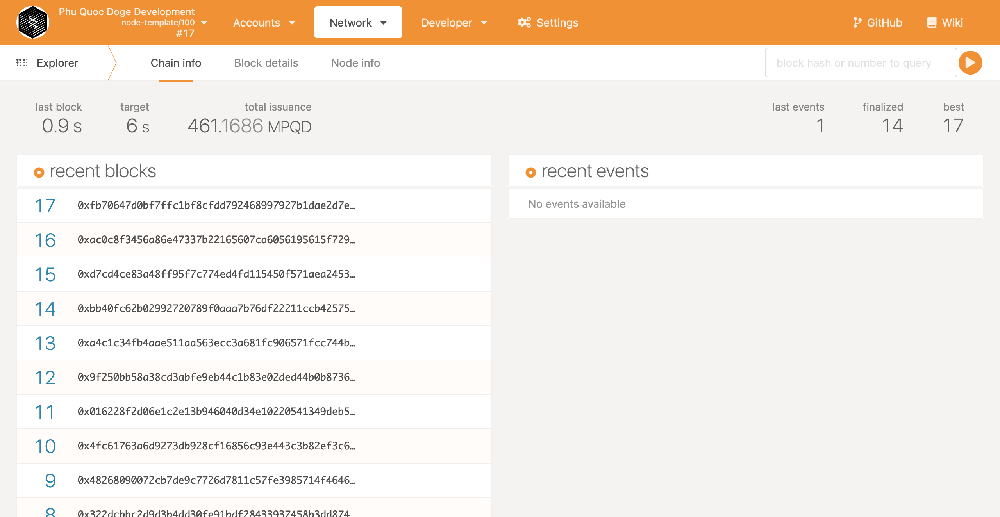

# Setting Up a Node

## 1. Install build tools & libraries <a id="__docusaurus"></a>

PhuQuoc Doge is the easiest to be set up on Unix-based operating systems like macOS or Linux. Here is the instruction on installing Rust's toolchains. If you have already done this, please go to the Step 3.

#### macOS

Open the Terminal application and execute the following commands:

```bash
# Install Homebrew if necessary https://brew.sh/
/bin/bash -c "$(curl -fsSL https://raw.githubusercontent.com/Homebrew/install/master/install.sh)"

# Make sure Homebrew is up-to-date, install openssl and cmake
brew update
brew install openssl cmake
```

#### Ubuntu/Debian

Use a terminal shell to execute the following commands:

```bash
sudo apt update
# May prompt for location information
sudo apt install -y cmake pkg-config libssl-dev git build-essential clang libclang-dev curl
```

#### Arch Linux

Run these commands from a terminal:

```bash
pacman -Syu --needed --noconfirm cmake gcc openssl-1.0 pkgconf git clang
export OPENSSL_LIB_DIR="/usr/lib/openssl-1.0"
export OPENSSL_INCLUDE_DIR="/usr/include/openssl-1.0"
```

## 2. Install Rust toolchain

This guide uses [`rustup`](https://rustup.rs/) to help manage the Rust toolchain. First, install and configure `rustup`:

```bash
# Install
curl https://sh.rustup.rs -sSf | sh
# Configure
source ~/.cargo/env
```

## 3. Compile the node

Let's start by cloning the master branch of the Phu Quoc Doge repo that you can find here: [https://github.com/phuquocdoge/node](https://github.com/phuquocdoge/node)

```bash
git clone https://github.com/phuquocdoge/node
cd node
```

Once you have followed all of the steps above, it's time to build the standalone node by running:

```bash
./scripts/init.sh
cargo build --release
```


The initial build will take a while, depending on your hardware. It may take 30 minutes for the build process to complete.


## 4. Run the Node

Then you will want to run the node in dev mode using the following command:

```text
./target/release/phuquocdoge-node --dev --rpc-cors=all  --unsafe-rpc-external  --unsafe-ws-external --validator --tmp -lruntime=debug
```

You should see an output that looks like the following, showing that blocks are being produced:

```
tranduythien at ThienTran in ~/github/phuquocdoge-node on master                                                         [4/23]
$ ./target/release/phuquocdoge-node --dev --rpc-cors=all  --unsafe-rpc-external  --unsafe-ws-external --validator --tmp -lrunti
me=debug                                                                                                                       
2021-07-19 15:15:21.147  INFO main sc_cli::runner: Substrate Node                                                              
2021-07-19 15:15:21.148  INFO main sc_cli::runner: ✌️  version 3.0.0-1ba3f05-x86_64-macos                                       
2021-07-19 15:15:21.148  INFO main sc_cli::runner: ❤️  by Substrate DevHub <https://github.com/phuquocdoge>, 2017-2021    
2021-07-19 15:15:21.148  INFO main sc_cli::runner: 📋 Chain specification: Phu Quoc Doge Development    
2021-07-19 15:15:21.148  INFO main sc_cli::runner: 🏷 Node name: disagreeable-square-6658    
2021-07-19 15:15:21.149  INFO main sc_cli::runner: 👤 Role: AUTHORITY    
2021-07-19 15:15:21.150  INFO main sc_cli::runner: 💾 Database: RocksDb at /var/folders/lb/hjcjnngs11nc87x6_wp5stsc0000gn/T/substrater3fLzT/chains/dev/db    
2021-07-19 15:15:21.150  INFO main sc_cli::runner: ⛓  Native runtime: node-template-100 (node-template-1.tx1.au1)    
2021-07-19 15:15:21.292  INFO main sc_service::client::client: 🔨 Initializing Genesis block/state (state: 0x0985…bb61, header-hash: 0x1452…8a14)    
2021-07-19 15:15:21.303  INFO main afg: 👴 Loading GRANDPA authority set from genesis on what appears to be first startup.    
2021-07-19 15:15:21.362  INFO main sc_consensus_slots: ⏱  Loaded block-time = 6s from genesis on first-launch    
2021-07-19 15:15:21.365  WARN main sc_service::config: Using default protocol ID "sup" because none is configured in the chain specs    
2021-07-19 15:15:21.371  INFO main sub-libp2p: 🏷 Local node identity is: 12D3KooWPmdCg4goNkNC1HGRk7noHz7aLdhKZyVXU4xvydfDravz     
2021-07-19 15:15:21.801  INFO main sc_service::builder: 📦 Highest known block at #0    
2021-07-19 15:15:21.803  INFO tokio-runtime-worker substrate_prometheus_endpoint::known_os: 〽️ Prometheus server started at 127.0.0.1:9615    
2021-07-19 15:15:21.811  INFO                 main parity_ws: Listening for new connections on 0.0.0.0:9944.    
2021-07-19 15:15:24.005  INFO tokio-runtime-worker sc_basic_authorship::basic_authorship: 🙌 Starting consensus session on top of parent 0x1452c2cc1fa70f53212f770ee5842575ef3116af7f4ba2440dac731465f38a14    
2021-07-19 15:15:24.014  INFO tokio-runtime-worker sc_basic_authorship::basic_authorship: 🎁 Prepared block for proposing at 1 [hash: 0x3436bf18e40eaa335f5180296d315231e926a9a4bb4f75c8dd6d7e82c6025d84; parent_hash: 0x1452…8a14; extrinsics (1): [0x5497…359e]]    
2021-07-19 15:15:24.018  INFO tokio-runtime-worker aura: 🔖 Pre-sealed block for proposal at 1. Hash now 0x1dfc5baa90658ac5c2e4b764709ea38fac0bdacc51a1012e27cf8635b124fac7, previously 0x3436bf18e40eaa335f5180296d315231e926a9a4bb4f75c8dd6d7e82c6025d84.


```

The local standalone PhuQuoc Doge node provides two RPC endpoints:

* HTTP: `http://127.0.0.1:9933`
* WS: `ws://127.0.0.1:9944`


### Connecting Polkadot JS Apps to a Local PhuQuoc Doge Node <a id="connecting-polkadot-js-apps-to-a-local-moonbeam-node"></a>

The locally-running Phu Quoc Doge node is a Substrate-based node, so we can interact with it using standard Substrate tools. Let’s start by connecting it with Phu Quoc Doge JS Apps.  
Visit https://polkadot.js.org/apps/#/explorer and you will see Polkadot JS Apps and are automatically connected to the Polkadot MainNet.



Click on the top left corner to open the menu and configure the networks, then navigate down to open the Development sub-menu. Select the "Local Node" option which points Polkadot JS Apps to `ws://127.0.0.1:9944`. Next, click on the Switch button and the site should be successfully connected to your standalone PhuQuoc Doge node.



With Polkadot JS Apps connected, you will see the standalone Phu Quoc Doge node producing blocks.



