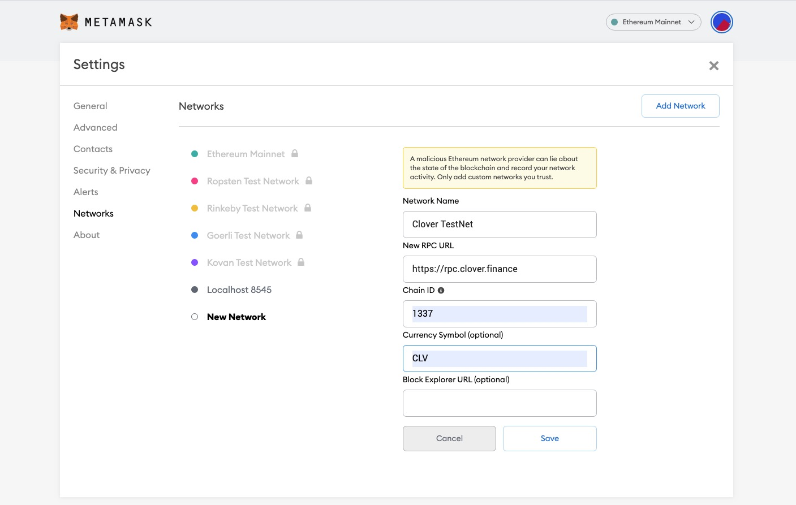
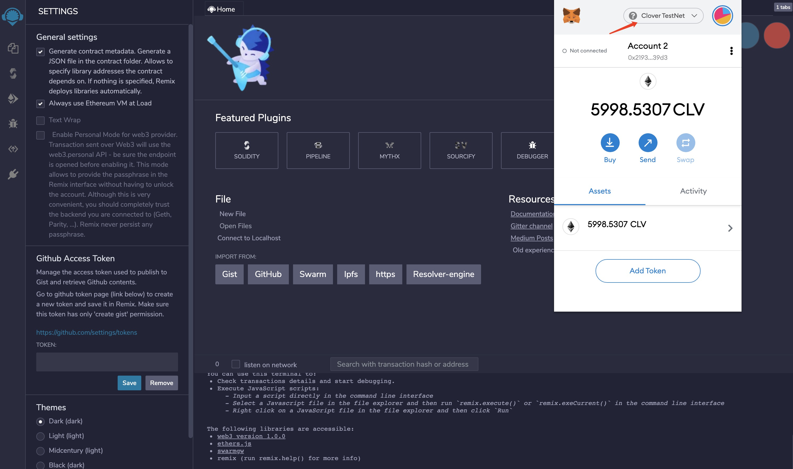

# TestNet \(Iris\)

## PhuQuoc Doge Test Net

Please refer to the following details for PhuQuoc Doge TestNet:

* Network Name: `PhuQuoc Doge TestNet`
* RPC URL: 
  * `https://rpc.clover.finance` 
  * `https://rpc-2.clover.finance` 
  * `https://rpc-3.clover.finance`
* Web Socket URL:
  * `wss://api.clover.finance`
  * `wss://api-2.clover.finance`
  * `wss://api-3.clover.finance`
* ChainID: `1023`
* Symbol \(Optional\): `CLV`


For a full list of clover networks please check out the [PhuQuoc Doge Network List](../clover-network-list.md) page.


## Using MetaMask for TestNet

In MetaMask, navigate to Settings -&gt; Networks -&gt; Add Network and fill in the above details:



Then the MetaMask can connect to PhuQuoc Doge TestNet. You can apply CLV for test via the faucet [https://faucet-iris.clover.finance/](https://faucet-iris.clover.finance/)

## Using Remix for Test Net

Make sure your MetaMask is connected to PhuQuoc DogeTestNet as described above.  The screen shot is as follows:



## Connect to PhuQuoc Doge TestNet

If you want to set up a local node, which can connect to PhuQuoc Doge TestNet, please use the following command to start your local node:

```bash
./target/release/clover --chain specs/clover-preview-iris.json --port 30333 --ws-port 9944 --rpc-port 9933  --name myNode --rpc-cors=all --rpc-methods=Unsafe --validator --unsafe-ws-external --unsafe-rpc-external
```

